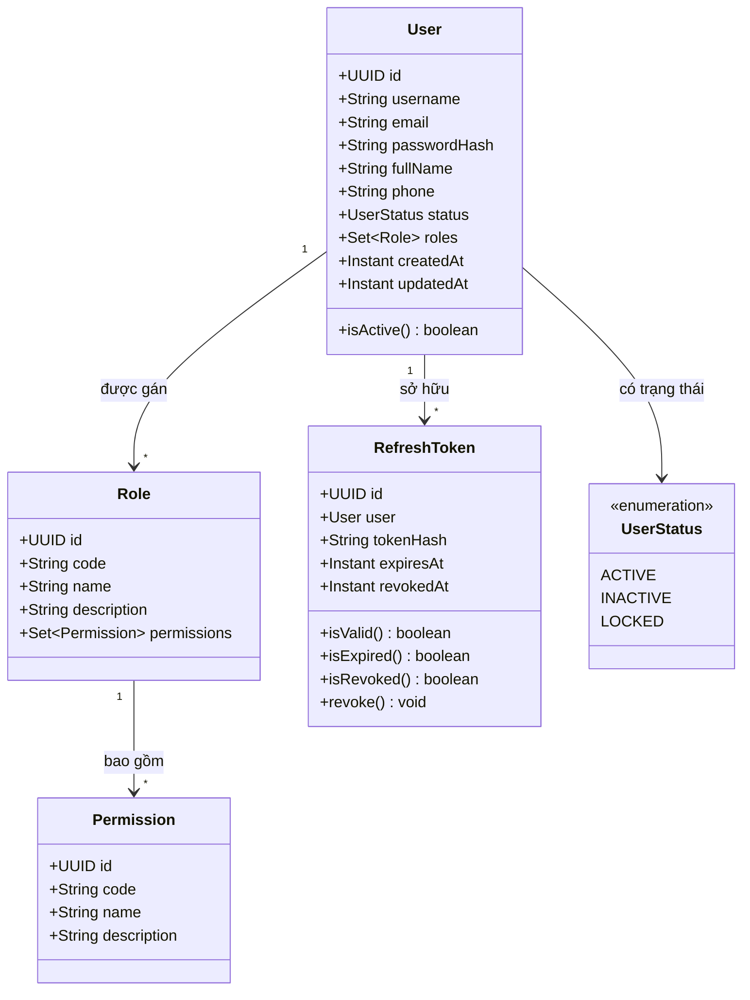

# Mô Hình Miền Dữ Liệu: Authentication & User (Domain Model)

Tài liệu này mô tả mô hình miền (Domain Model) cho Module **Authentication & User Management**.

---

## 1. Biểu Đồ Quan Hệ Thực Thể Miền (Domain Entities)

---

## 2. Trách Nhiệm Từng Đối Tượng Miền

* **`User`**: Đại diện cho chủ thể định danh trong hệ thống (nhân viên, quản lý, tài xế, khách hàng). Chịu trách nhiệm lưu vết bảo mật, trạng thái hoạt động và các vai trò sở hữu.
* **`Role`**: Đại diện cho vai trò định hình theo chức năng tổ chức (ví dụ: `ADMIN`, `OPERATOR`, `STAFF`, `CUSTOMER`).
* **`Permission`**: Đại diện cho thẩm quyền hành động độc lập trên tài nguyên miền (ví dụ: `USER_READ`, `USER_CREATE`).
* **`RefreshToken`**: Quản lý phiên làm việc ngoại tuyến, vòng đời sống của token, thời điểm thu hồi và mã băm SHA-256 an toàn.
