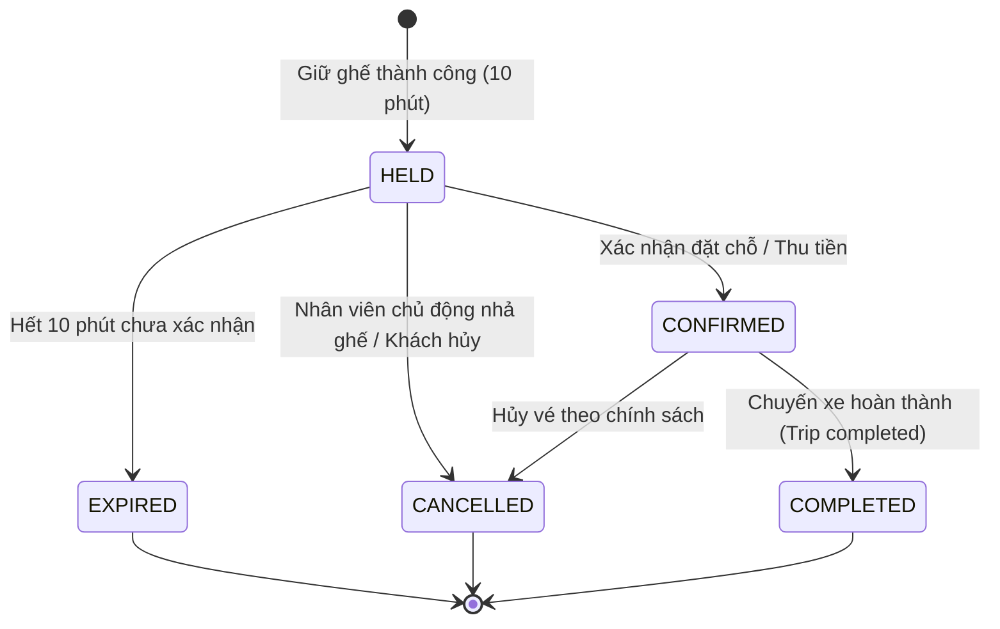

# Thiết Kế Chi Tiết Phân Hệ CRM Booking Management (Architecture & Business Design)

Tài liệu này là đặc tả kỹ thuật chi tiết và chuẩn mực thiết kế (Design Specification) cho phân hệ **CRM Booking Management** của Hệ thống Vận tải & Đặt vé Đông Lý, đóng vai trò là kim chỉ nam kiến trúc trước khi triển khai mã nguồn.

---

## 1. TỔNG QUAN VÀ ĐỊNH VỊ PHÂN HỆ (MODULE OVERVIEW)

* **Tên phân hệ**: `com.dongly.modules.booking` (Backend) & `src/app/features/bookings` (Frontend).
* **Mục tiêu**: Cung cấp công cụ vận hành mạnh mẽ, trực quan cho nhân viên CRM / Tổng đài / Quầy vé để tra cứu chuyến xe, xem sơ đồ ghế thời gian thực, giữ chỗ tạm thời (Seat Hold), nhập thông tin hành khách/điểm đón trả, tạo đơn đặt vé (Booking), phát hành vé điện tử (Ticket) và thực hiện đổi ghế, đổi chuyến, hủy vé an toàn tuyệt đối về mặt dữ liệu.
* **Nguyên tắc thiết kế cốt lõi**:
  1. **Tối đa hóa tái sử dụng**: Kế thừa nguyên vẹn các module và bảng hiện có (`trips`, `trip_runs`, `vehicles`, `vehicle_seats`, `routes`, `route_stops`, `users`, `roles`, `permissions`).
  2. **Tách bạch trạng thái**: Phân định rõ ràng giữa Trạng thái Đơn hàng (`BookingStatus`), Trạng thái Thanh toán (`PaymentStatus`) và Trạng thái Vé điện tử (`TicketStatus`).
  3. **Không bao giờ tin tưởng Client**: Toàn bộ việc tính giá, phụ phí, kiểm tra xung đột chỗ ngồi, phân quyền và kiểm soát hạn giữ chỗ được thực thi và khóa bảo vệ tại Backend.
  4. **An toàn đồng thời tuyệt đối (Concurrency Safety)**: Phối hợp 2 tầng bảo vệ: Khóa bi quan (`PESSIMISTIC_WRITE`) tại tầng ứng dụng và Ràng buộc Partial Unique Index tại Database PostgreSQL.

---

## 2. QUAN HỆ GIỮA CÁC THỰC THỂ (DOMAIN ENTITY RELATIONSHIPS)

Hệ thống tái sử dụng 100% các thực thể hiện hữu và chỉ bổ sung 5 thực thể nghiệp vụ mới:

```text
[User] (Staff/Admin) ───(1:N)───┐
                                │ creates
[Customer] (Khách đặt) ─(1:N)───┼──> [Booking] ───(1:N)───> [Payment]
                                │       │
[Trip] (Chuyến xe) ──────(1:N)──┘       │ (1:N)
                                        ▼
[VehicleSeat] ───────────(1:N)─────> [BookingItem] (Chi tiết vé / Ghế)
                                   (lưu tên khách đi)
[RouteStop] (Điểm đón) ──(1:N)───────┤  │
[RouteStop] (Điểm trả) ──(1:N)───────┘  │ (1:1)
                                        ▼
                                     [Ticket] (Vé điện tử + QR)
```

### Chi tiết vai trò từng thực thể:
1. **`User` (Hiện có - `users`)**: Đại diện cho nhân viên CRM / điều hành thực hiện thao tác tạo booking, đổi ghế, xác nhận thu tiền (`createdBy`, `updatedBy`).
2. **`Customer` (Thực thể mới - `customers`)**: Đại diện cho khách hàng đứng tên đặt chỗ (người liên hệ chính qua điện thoại/quầy). Quản lý thông tin `phone`, `fullName`, `email`, tổng số đơn đặt vé.
3. **`Trip` (Hiện có - `trips`)**: Chuyến xe cụ thể khách chọn đi. Một booking chỉ thuộc về một Trip.
4. **`VehicleSeat` (Hiện có - `vehicle_seats`)**: Ghế vật lý trên xe. Trạng thái khách ngồi hay chưa **không lưu vào VehicleSeat** mà được xác định qua `BookingItem` của `Trip` tương ứng.
5. **`RouteStop` (Hiện có - `route_stops`)**: Điểm đón (`pickupStop`) và điểm trả (`dropoffStop`) của hành khách, dùng để đón trả khách đúng điểm và tính phụ phí dọc đường.
6. **`Booking` (Thực thể mới - `bookings`)**: Đơn đặt vé tổng (Header). Chứa mã đơn `bookingCode`, chuyến xe, người đặt, kênh đặt vé (`CRM_PHONE`, `CRM_POS`, `ONLINE`), tổng tiền, thời hạn giữ ghế và trạng thái đơn.
7. **`BookingItem` (Thực thể mới - `booking_items`)**: Bản ghi chi tiết từng ghế/vé (Line Item). Lưu thông tin hành khách thực tế ngồi ghế (`passengerName`, `passengerPhone`), điểm đón/trả riêng của ghế đó, chi tiết giá vé tại thời điểm đặt (`basePrice`, `seatExtraPrice`, `stopExtraPrice`, `finalPrice`) và trạng thái giữ/bán của ghế.
8. **`Payment` (Thực thể mới - `payments`)**: Giao dịch thanh toán gắn với đơn đặt vé (`CASH`, `BANK_TRANSFER`, `VIETQR`).
9. **`Ticket` (Thực thể mới - `tickets`)**: Vé điện tử chính thức được phát hành khi đơn hoàn tất thanh toán hoặc xác nhận hợp lệ. Mỗi `BookingItem` liên kết với duy nhất 1 `Ticket` chứa mã vé và chuỗi mã hóa QR Code.

---

## 3. THIẾT KẾ STATE MACHINE & TRANSITIONS

### 3.1. State Machine của `Booking` (`BookingStatus`)



* **Ma trận chuyển trạng thái hợp lệ**:
  * `HELD` $\rightarrow$ `CONFIRMED`, `CANCELLED`, `EXPIRED`.
  * `CONFIRMED` $\rightarrow$ `COMPLETED`, `CANCELLED`.
  * `EXPIRED` $\rightarrow$ Không thể chuyển tiếp (Final state).
  * `CANCELLED` $\rightarrow$ Không thể chuyển tiếp (Final state).
  * `COMPLETED` $\rightarrow$ Không thể chuyển tiếp (Final state).

### 3.2. Phân biệt rõ rệt giữa 3 nhóm trạng thái:

| Nghiệp vụ | Enum / Trạng thái | Các giá trị hợp lệ | Ý nghĩa thực tế |
| :--- | :--- | :--- | :--- |
| **Đơn đặt vé** | `BookingStatus` | `HELD`<br>`CONFIRMED`<br>`CANCELLED`<br>`EXPIRED`<br>`COMPLETED` | Vòng đời pháp lý của đơn đặt chỗ trong hệ thống. |
| **Thanh toán** | `PaymentStatus` | `PAID`<br>`CANCELLED`<br>`REFUNDED` | Đơn chỉ chuyển `CONFIRMED` khi đã thanh toán thành công (`CASH`, `BANK_TRANSFER`, `VIETQR`). Tuyệt đối không cho phép giữ vé dạng thanh toán khi lên xe. |
| **Vé điện tử** | `TicketStatus` | `ISSUED`<br>`CHECKED_IN`<br>`CANCELLED` | Trạng thái sử dụng vé khi khách lên xe. Vé chỉ sinh ra đồng thời khi Booking chuyển `CONFIRMED`. |

---

## 4. QUY TẮC TÍNH GIÁ, LƯU GIÁ VÀ TỔNG TIỀN

Theo yêu cầu nghiệp vụ đã chốt: **Phụ phí tính cộng theo từng ghế (đặt bao nhiêu ghế tính bấy nhiêu lần phụ phí)**.

### 4.1. Công thức tính giá từng ghế (`BookingItem.finalPrice`)
$$\text{finalPrice} = \text{basePrice} + \text{seatExtraPrice} + \text{pickupExtraPrice} + \text{dropoffExtraPrice}$$
Trong đó:
* `basePrice`: Giá cước cơ bản của chuyến đi (`Trip.basePrice`).
* `seatExtraPrice`: Phụ phí loại ghế vật lý (`VehicleSeat.extraPrice`, ví dụ phòng VIP +50.000đ).
* `pickupExtraPrice`: Phụ phí điểm đón nếu có (`RouteStop.extraPrice` của điểm đón).
* `dropoffExtraPrice`: Phụ phí điểm trả nếu có (`RouteStop.extraPrice` của điểm trả).

### 4.2. Công thức tính tổng tiền đơn vé (`Booking.totalAmount`)
$$\text{totalAmount} = \sum_{i=1}^{n} \text{BookingItem}[i].\text{finalPrice}$$

### 4.3. Nguyên tắc bất biến về giá (Price Immutability):
* **Snapshot giá tại thời điểm đặt**: Toàn bộ các giá trị `basePrice`, `seatExtraPrice`, `pickupExtraPrice`, `dropoffExtraPrice`, `finalPrice` phải được ghi cứng vào từng dòng `booking_items`.
* **Không tính động lại sau khi đã xác nhận**: Nếu sau này giá tuyến tăng hoặc phụ phí điểm dừng thay đổi, các đơn vé đã đặt trước đó vẫn giữ nguyên vẹn giá tiền đã thỏa thuận.

---

## 5. THIẾT KẾ SEAT HOLD: THỜI HẠN, QUYỀN SỞ HỮU & CHỐNG GIỮ TRÙNG

### 5.1. Thời gian giữ ghế (Hold TTL) & Quyền sở hữu
* **Thời gian cố định**: Đúng **10 phút** kể từ thời điểm bấm giữ chỗ:
  $$\text{holdExpiresAt} = \text{Instant.now()} + 10\text{ minutes}$$
* **Quyền sở hữu (Ownership)**:
  * Đơn giữ ghế gắn với `staffId / username` của nhân viên thực hiện (`bookings.created_by`) và mã đơn `bookingId`.
  * Chỉ nhân viên tạo đơn (hoặc `ADMIN`) mới có quyền thao tác cập nhật thông tin, hủy giữ hoặc chuyển sang `CONFIRMED` cho booking đó.

### 5.2. Giải pháp chống giữ trùng (Concurrency & Double-booking Safety)

```text
[Client 1: Giữ ghế A01]        [Client 2: Giữ ghế A01]
          │                              │
          ▼                              ▼
  Pessimistic Lock               Pessimistic Lock
 (Khóa Trip/Seat trong DB)      (Chờ giao dịch trước)
          │                              │
   Kiểm tra: Trống                Kiểm tra: BỊ TRÙNG!
          │                              │
  INSERT booking_items                   ▼
  uq_booking_items_active_trip_seat -> Ném Ngoại Lệ
          │                         SEAT_ALREADY_RESERVED
          ▼                              │
    201 Created                          ▼
   (Giữ 10 phút)                    409 Conflict
```

1. **Khóa bi quan tại Service**:
   * Khi gọi API `/hold`, mở transaction `@Transactional`.
   * Truy vấn kiểm tra các ghế yêu cầu bằng `Pessimistic Write Lock` để đồng bộ tuần tự hóa các yêu cầu cạnh tranh cùng một ghế.
2. **Chặn vật lý tại Cơ sở dữ liệu (Partial Unique Index)**:
   ```sql
   CREATE UNIQUE INDEX uq_booking_items_active_trip_seat
   ON booking_items (trip_id, seat_id)
   WHERE status IN ('HELD', 'CONFIRMED');
   ```
   *Ràng buộc này triệt tiêu 100% khả năng có 2 bản ghi cùng giữ 1 ghế trên cùng 1 chuyến tại cùng thời điểm, kể cả trong tình huống phân tán đa phiên bản ứng dụng.*
3. **Cơ chế thu hồi ghế quá hạn (Background Auto-Release)**:
   * Một Spring `@Scheduled(fixedRate = 30000)` (30 giây/lần) chạy background worker:
     * Quét các `Booking` có `status = 'HELD'` và `hold_expires_at <= NOW()`.
     * Cập nhật `Booking.status = 'EXPIRED'` và `BookingItem.status = 'EXPIRED'`.
   * Tại tất cả các truy vấn xem sơ đồ ghế: Ghế có `status = 'HELD'` nhưng `hold_expires_at <= NOW()` được tính ngay là **Ghế trống (AVAILABLE)** mà không cần chờ background worker quét tới.

---

## 6. ĐẶC TẢ REST API CONTRACT (MODULE CRM BOOKING)

Tất cả API tuân thủ tiêu chuẩn envelope `ApiResponse<T>` / `PageResponse<T>` và được bảo vệ bởi `@PreAuthorize("hasAuthority('BOOKING_MANAGE')")` hoặc `hasAuthority('BOOKING_READ')`.

### 6.1. `GET /api/v1/crm/bookings/trips/search`
* **Mục đích**: Tìm kiếm chuyến xe mở bán cho CRM theo tuyến hoặc điểm đi/đến và ngày khởi hành.
* **Quyền hạn**: `BOOKING_READ`
* **Query Params**:
  * `routeId` (UUID, optional)
  * `originLocationId` (UUID, optional)
  * `destinationLocationId` (UUID, optional)
  * `departureDate` (LocalDate, required, vd: `2026-10-15`)
  * `page`, `size` (int, default 0, 20)
* **Response (200 OK)**:
```json
{
  "success": true,
  "message": "Tìm kiếm chuyến xe thành công",
  "data": {
    "items": [
      {
        "tripId": "d1111111-1111-1111-1111-111111111111",
        "tripCode": "TRP-20261015-0400-36B02868",
        "routeId": "a1111111-...",
        "routeName": "Thanh Hóa - Hà Nội",
        "vehiclePlateNumber": "36B-028.68",
        "vehicleType": "LIMOUSINE",
        "departureTime": "2026-10-15T04:00:00+07:00",
        "estimatedArrivalTime": "2026-10-15T07:00:00+07:00",
        "basePrice": 250000.00,
        "totalSeats": 22,
        "availableSeats": 18,
        "status": "SCHEDULED"
      }
    ],
    "pagination": { "page": 0, "size": 20, "totalElements": 1, "totalPages": 1 }
  }
}
```

### 6.2. `GET /api/v1/crm/trips/{tripId}/seat-map`
* **Mục đích**: Lấy sơ đồ ghế chi tiết của chuyến xe kèm trạng thái thời gian thực từng ghế và danh sách điểm dừng của chuyến.
* **Quyền hạn**: `BOOKING_READ`
* **Response (200 OK)**:
```json
{
  "success": true,
  "message": "Lấy sơ đồ ghế chuyến xe thành công",
  "data": {
    "tripId": "d1111111-...",
    "tripCode": "TRP-20261015-0400-36B02868",
    "basePrice": 250000.00,
    "vehicle": {
      "plateNumber": "36B-028.68",
      "totalFloors": 2,
      "totalRows": 6,
      "totalColumns": 3
    },
    "seats": [
      {
        "seatId": "e1111111-...",
        "seatCode": "A01",
        "floor": 1,
        "rowIndex": 1,
        "columnIndex": 1,
        "seatType": "LUXURY_ROOM",
        "extraPrice": 50000.00,
        "calculatedPrice": 300000.00,
        "occupancyStatus": "AVAILABLE",
        "heldExpiresAt": null,
        "occupantName": null
      },
      {
        "seatId": "e2222222-...",
        "seatCode": "A02",
        "floor": 1,
        "rowIndex": 1,
        "columnIndex": 3,
        "seatType": "LUXURY_ROOM",
        "extraPrice": 50000.00,
        "calculatedPrice": 300000.00,
        "occupancyStatus": "HELD",
        "heldExpiresAt": "2026-10-11T10:05:00+07:00",
        "occupantName": "Nguyễn Văn A"
      }
    ],
    "stops": [
      { "id": "s1...", "name": "Bến xe phía Bắc Thanh Hóa", "type": "PICKUP", "sequence": 1, "extraPrice": 0.00 },
      { "id": "s2...", "name": "Big C Thăng Long Hà Nội", "type": "DROPOFF", "sequence": 5, "extraPrice": 20000.00 }
    ]
  }
}
```

### 6.3. `POST /api/v1/crm/bookings/hold`
* **Mục đích**: Nhân viên CRM giữ tạm thời 1 hoặc nhiều ghế cho khách (cố định 10 phút).
* **Quyền hạn**: `BOOKING_MANAGE`
* **Request (Body)**:
```json
{
  "tripId": "d1111111-1111-1111-1111-111111111111",
  "seatIds": ["e1111111-1111-1111-1111-111111111111", "e3333333-3333-3333-3333-333333333333"],
  "customerPhone": "0912345678",
  "customerName": "Nguyễn Văn Nam",
  "note": "Khách gọi tổng đài nhờ giữ phòng đôi tầng 1"
}
```
* **Response (201 Created)**:
```json
{
  "success": true,
  "message": "Giữ ghế thành công trong 10 phút",
  "data": {
    "bookingId": "b8888888-8888-8888-8888-888888888888",
    "bookingCode": "DL-261011-0001",
    "status": "HELD",
    "holdExpiresAt": "2026-10-11T10:01:14+07:00",
    "heldSeats": ["A01", "A03"],
    "totalEstimatedAmount": 600000.00
  }
}
```

### 6.4. `POST /api/v1/crm/bookings/{id}/confirm`
* **Mục đích**: Hoàn tất thông tin hành khách, điểm đón/trả và xác nhận đơn đặt vé (xuất vé).
* **Quyền hạn**: `BOOKING_MANAGE`
* **Request (Body)**:
```json
{
  "customerName": "Nguyễn Văn Nam",
  "customerPhone": "0912345678",
  "customerEmail": "nam@gmail.com",
  "passengers": [
    {
      "seatId": "e1111111-1111-1111-1111-111111111111",
      "passengerName": "Nguyễn Văn Nam",
      "passengerPhone": "0912345678",
      "pickupStopId": "s1111111-...",
      "dropoffStopId": "s2222222-..."
    },
    {
      "seatId": "e3333333-3333-3333-3333-333333333333",
      "passengerName": "Lê Thị Lan",
      "passengerPhone": "0987654321",
      "pickupStopId": "s1111111-...",
      "dropoffStopId": "s2222222-..."
    }
  ],
  "payment": {
    "method": "CASH",
    "amount": 640000.00,
    "transactionCode": null,
    "note": "Thu tiền mặt trực tiếp tại quầy"
  }
}
```
* **Response (200 OK)**: Trả về chi tiết `BookingResponse` với status `CONFIRMED`, danh sách `TicketResponse` kèm mã QR code.

### 6.5. `POST /api/v1/crm/bookings/{id}/cancel`
* **Mục đích**: Hủy đơn đặt vé (nhả ghế ngay lập tức).
* **Quyền hạn**: `BOOKING_MANAGE`
* **Request (Body)**:
```json
{
  "reason": "Khách báo bận việc đột xuất không đi được",
  "refundAmount": 0.00
}
```
* **Response (200 OK)**: Trả về thông báo hủy thành công, trạng thái `CANCELLED`.

### 6.6. `POST /api/v1/crm/bookings/{id}/change-seat`
* **Mục đích**: Đổi ghế trên cùng chuyến hoặc chuyển sang chuyến khác còn chỗ.
* **Quyền hạn**: `BOOKING_MANAGE`
* **Request (Body)**:
```json
{
  "bookingItemId": "item-1111-...",
  "targetTripId": "d1111111-...",
  "newSeatId": "e5555555-...",
  "newPickupStopId": "s1111111-...",
  "newDropoffStopId": "s2222222-...",
  "reason": "Khách muốn chuyển từ tầng 2 xuống tầng 1"
}
```
* **Response (200 OK)**: Trả về thông tin ghế mới, tính toán tiền chênh lệch cần thu thêm hoặc hoàn trả.

### 6.7. `GET /api/v1/crm/bookings`
* **Mục đích**: Tra cứu danh sách đơn đặt vé CRM phân trang và đa tiêu chí.
* **Quyền hạn**: `BOOKING_READ`
* **Query Params**: `keyword` (mã đơn, tên, sđt), `tripId`, `status`, `paymentStatus`, `fromDate`, `toDate`, `page`, `size`, `sort`.
* **Response (200 OK)**: Trả về chuẩn `PageResponse<BookingSummaryResponse>`.

---

## 7. QUẢN LÝ LỖI, BẢO MẬT & DATABASE CONSTRAINTS

### 7.1. Bổ sung Error Codes vào `ErrorCode.java`:
* `SEAT_ALREADY_RESERVED (409 CONFLICT)`: "Ghế này đã có người giữ hoặc đặt thành công."
* `SEAT_HOLD_EXPIRED (410 GONE)`: "Thời hạn giữ ghế 10 phút đã kết thúc, đơn đặt chỗ đã hết hiệu lực."
* `SEAT_NOT_AVAILABLE (422 UNPROCESSABLE_ENTITY)`: "Ghế đang ở trạng thái bảo trì hoặc không mở bán."
* `INVALID_STATUS_TRANSITION (422 UNPROCESSABLE_ENTITY)`: "Không thể chuyển trạng thái đơn hàng theo luồng này."
* `BOOKING_ALREADY_CONFIRMED (409 CONFLICT)`: "Đơn đặt vé đã hoàn tất xác nhận, không thể giữ chỗ lại."
* `PAYMENT_AMOUNT_MISMATCH (400 BAD_REQUEST)`: "Số tiền thanh toán không khớp với tổng tiền đơn vé."

### 7.2. Ràng buộc toàn vẹn Cơ sở dữ liệu (Database Constraints):
1. `chk_bookings_status`: `CHECK (status IN ('HELD', 'CONFIRMED', 'CANCELLED', 'EXPIRED', 'COMPLETED'))`
2. `chk_bookings_channel`: `CHECK (channel IN ('CRM_PHONE', 'CRM_POS', 'ONLINE'))`
3. `chk_payment_method`: `CHECK (payment_method IN ('CASH', 'BANK_TRANSFER', 'VIETQR'))`
4. `chk_payment_status`: `CHECK (status IN ('PAID', 'CANCELLED', 'REFUNDED'))`
5. `chk_ticket_status`: `CHECK (status IN ('ISSUED', 'CHECKED_IN', 'CANCELLED'))`
6. `uq_booking_items_active_trip_seat`: Unique Partial Index chặn trùng ghế trên cùng chuyến:
   ```sql
   CREATE UNIQUE INDEX uq_booking_items_active_trip_seat
   ON booking_items (trip_id, seat_id)
   WHERE status IN ('HELD', 'CONFIRMED');
   ```

---

## 8. KẾ HOẠCH MIGRATION & PHƯƠNG ÁN ROLLBACK

### 8.1. File Migration Flyway: `V8__create_customer_booking_and_ticket_tables.sql`
Gồm 5 bảng chính được khởi tạo theo thứ tự dependency:
1. `customers` (Lưu thông tin khách hàng).
2. `bookings` (Header đơn đặt vé).
3. `booking_items` (Chi tiết từng ghế và hành khách).
4. `payments` (Lịch sử thanh toán & hoàn tiền).
5. `tickets` (Vé điện tử phát hành kèm mã QR).

### 8.2. Kịch bản Rollback (Khi xảy ra sự cố deploy):
Tạo file kịch bản hạ cấp (Down script) dự phòng `U8__rollback_booking_tables.sql`:
```sql
DROP TABLE IF EXISTS tickets CASCADE;
DROP TABLE IF EXISTS payments CASCADE;
DROP TABLE IF EXISTS booking_items CASCADE;
DROP TABLE IF EXISTS bookings CASCADE;
DROP TABLE IF EXISTS customers CASCADE;
```
*Do toàn bộ các bảng mới là độc lập và chỉ tham chiếu (Foreign Key) tới `trips`, `vehicle_seats`, `route_stops`, việc rollback hoàn toàn không làm gián đoạn hay mất mát dữ liệu của các bảng hiện có.*

---

## 9. QUY CHUẨN XỬ LÝ CHÊNH LỆCH GIÁ KHI ĐỔI GHẾ / HỦY VÉ (ĐÃ THỐNG NHẤT)

1. **Khi đổi sang ghế/chuyến có giá cao hơn**:
   * Hệ thống tính toán chênh lệch thiếu: `additionalAmount = newPrice - oldPrice`.
   * Tạo bản ghi `Payment` thu bổ sung với `amount = additionalAmount`, phương thức `CASH`, `BANK_TRANSFER` hoặc `VIETQR`.
2. **Khi đổi sang ghế/chuyến có giá thấp hơn hoặc khi Hủy vé**:
   * Hệ thống tính toán chênh lệch thừa: `refundAmount = oldPrice - newPrice`.
   * **Quy tắc hoàn tiền**: Nhân viên CRM **hoàn tiền mặt/chuyển khoản trực tiếp cho khách ngay tại thời điểm thao tác**.
   * Tạo bản ghi `Payment` ghi nhận khoản hoàn tiền âm (`status = 'REFUNDED'`, `amount = refundAmount`, `note = 'Hoàn tiền trực tiếp cho khách do đổi vé/hủy vé'`).
3. **Chính sách thanh toán**:
   * **Tuyệt đối loại bỏ hình thức "Thanh toán khi lên xe (PAY_ON_BOARD)"** để loại bỏ rủi ro thất thoát vé và khó kiểm soát ghế ảo. Đơn đặt vé chỉ được chuyển sang `CONFIRMED` và phát hành vé điện tử `Ticket` khi tiền đã được thu qua `CASH`, `BANK_TRANSFER` hoặc quét mã `VIETQR`.

