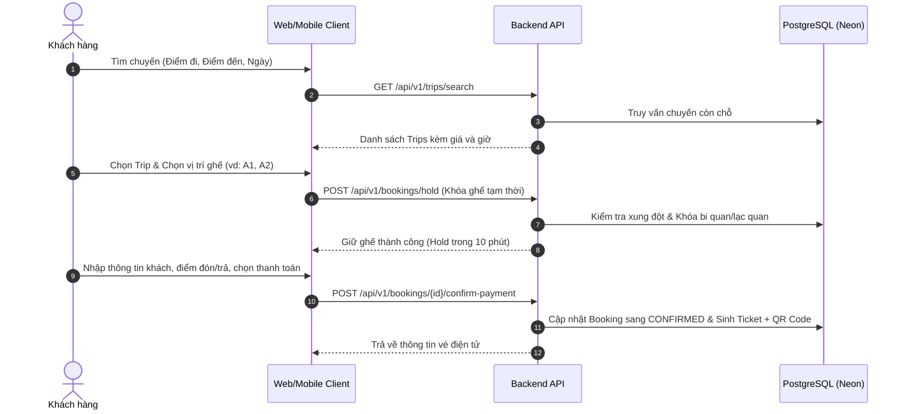

# Tổng Quan Dự Án & Yêu Cầu Nghiệp Vụ (Project Overview & Business Requirements)

* **Tên dự án**: Hệ Thống Đặt Vé Xe Khách Trực Tuyến & Quản Lý Vận Tải Đông Lý
* **Phiên bản tài liệu**: 1.0.0
* **Trạng thái**: MVP (Minimum Viable Product)
* **Lĩnh vực (Domain)**: Transportation / Bus Fleet Management & Ticket Booking
* **Đơn vị chủ quản**: Nhà xe Đông Lý

---

## 1. Giới Thiệu & Bối Cảnh Dự Án

**Đông Lý** là doanh nghiệp vận tải hành khách uy tín, khai thác các tuyến xe liên tỉnh trọng điểm kết nối tỉnh Thanh Hóa với các trung tâm kinh tế phía Bắc, tiêu biểu gồm:

* **Thanh Hóa ↔ Hà Nội**
* **Thanh Hóa ↔ Hải Phòng**
* **Thanh Hóa ↔ Bắc Ninh**

Dự án này được xây dựng nhằm số hóa toàn diện quy trình vận hành và kinh doanh vận tải:

1. **Khách hàng**: Tìm kiếm tuyến, chọn chuyến xe, chọn vị trí ghế theo sơ đồ thực tế, chọn điểm đón/trả linh hoạt, đặt vé và thanh toán trực tuyến, tra cứu và nhận vé điện tử kèm mã QR.
2. **Ban điều hành & Nhân viên**: Quản lý tuyến đường, điểm dừng, phương tiện, cấu hình sơ đồ ghế, tài xế, lập lịch vòng chạy xe (`TripRun`), quản lý chuyến đi - về (`Trip`), theo dõi trạng thái ghế thời gian thực, quản lý đơn đặt vé (`Booking`), quản lý doanh thu và danh sách hành khách lên xe.
3. **Đội ngũ vận hành/tài xế (Phase tiếp theo)**: Điều hành xe trên tuyến, kiểm soát check-in hành khách theo từng điểm dừng.

---

## 2. Mục Tiêu Dự Án

### 2.1. Phía Khách Hàng (Customer Portal)
* Tìm kiếm chuyến xe theo điểm xuất phát, điểm đến, ngày khởi hành và số lượng hành khách.
* Xem chi tiết chuyến xe: Giờ xuất bến, giờ đến dự kiến, loại xe (Limousine, giường nằm), giá vé, danh sách điểm đón/trả.
* Chọn vị trí ghế trực quan theo sơ đồ xe.
* Nhập thông tin hành khách (hỗ trợ **Guest Booking** - không bắt buộc đăng ký tài khoản ở giai đoạn MVP).
* Cơ chế giữ ghế tự động trong thời gian giới hạn (ví dụ: 10 phút) để khách thanh toán.
* Thanh toán vé qua chuyển khoản ngân hàng hoặc tiền mặt khi lên xe.
* Nhận vé điện tử (mã vé, thông tin chuyến, mã QR) và tra cứu vé nhanh qua `Mã đặt vé + Số điện thoại`.
* Yêu cầu hủy vé theo chính sách hoàn/hủy cấu hình sẵn.

### 2.2. Phía Quản Trị & Nhân Viên (Admin & Operation Portal)
* **Quản lý danh mục**: Tuyến (`Route`), hướng tuyến (`RouteDirection`), địa điểm (`Location`), điểm đón/trả (`RouteStop`).
* **Quản lý đội xe & nhân sự**: Xe (`Vehicle`), sơ đồ ghế (`VehicleSeat`), tài xế (`Driver`).
* **Điều hành & Lập lịch**: Tạo vòng quay xe (`TripRun`), tạo chuyến đi/về (`Trip`), gán tài xế và phương tiện, cấu hình giá vé.
* **Quản lý đơn hàng**: Tiếp nhận booking trực tiếp/qua điện thoại, xác nhận thanh toán, đổi ghế, hủy vé.
* **Vận hành chuyến**: Xuất danh sách hành khách theo từng điểm đón/trả phục vụ tài xế và phụ xe đón khách chính xác.
* **Thống kê & Báo cáo**: Bảng điều khiển (Dashboard) theo dõi doanh thu hôm nay, tỷ lệ lấp đầy ghế, số chuyến đang chạy.

---

## 3. Các Nguyên Tắc Nghiệp Vụ Cốt Lõi (Core Domain Principles)

### 3.1. Phân Biệt Tuyệt Đối: Route vs RouteDirection vs Trip

Một trong những sai lầm phổ biến nhất trong hệ thống vận tải là gộp chung tuyến đường và chuyến xe. Hệ thống Đông Lý phân định rõ ràng 3 cấp độ:

```text
               ROUTE (Tuyến cố định)
             Thanh Hóa ↔ Hà Nội (TH_HN)
                         │
        ┌────────────────┴────────────────┐
        ▼                                 ▼
ROUTE DIRECTION (Chiều đi)       ROUTE DIRECTION (Chiều về)
 OUTBOUND: Thanh Hóa → Hà Nội      RETURN: Hà Nội → Thanh Hóa
        │                                 │
        ▼                                 ▼
   TRIP (Chuyến cụ thể)              TRIP (Chuyến cụ thể)
Trip #001: 04:00 (08/10/2026)     Trip #002: 08:00 (08/10/2026)
```

1. **Route (Tuyến đường)**: Cung đường vận tải cố định kết nối hai khu vực địa lý (ví dụ: `Thanh Hóa ↔ Hà Nội`).
2. **RouteDirection (Hướng tuyến)**: Xác định chiều di chuyển cụ thể:
   * `OUTBOUND`: Chiều đi (Thanh Hóa → Hà Nội).
   * `RETURN`: Chiều về (Hà Nội → Thanh Hóa).
   * *Quy tắc*: Chiều đi và chiều về thuộc cùng một Route, không tách thành 2 Route rời rạc.
3. **Trip (Chuyến xe)**: Một chuyến xe cụ thể chạy theo một `RouteDirection` tại một thời điểm khởi hành xác định (ví dụ: Chuyến 04:00 ngày 08/10/2026 từ Thanh Hóa đi Hà Nội).

---

## 4. Mô Hình Vận Hành Vòng Quay Xe (`TripRun`)

Trong thực tế vận tải liên tỉnh, một chiếc xe không chỉ chạy một chuyến rồi dừng lại mà hoạt động theo chu kỳ khép kín trong ngày.

Khái niệm **`TripRun`** đại diện cho **một vòng vận hành của một phương tiện cùng tài xế trong một ngày**.

### 4.1. Cấu Trúc TripRun
```text
TripRun: RUN-20261008-001
├── Ngày vận hành: 2026-10-08
├── Xe: 36B-123.45 (Limousine 11 chỗ)
├── Tài xế: Nguyễn Văn A
│
├── [Trip #1] 04:00 | OUTBOUND: Thanh Hóa → Hà Nội
├── [Trip #2] 08:00 | RETURN:   Hà Nội → Thanh Hóa
├── [Trip #3] 14:00 | OUTBOUND: Thanh Hóa → Hà Nội
└── [Trip #4] 18:00 | RETURN:   Hà Nội → Thanh Hóa
```

### 4.2. Tính Độc Lập Nghiệp Vụ Giữa Các Trip
* Các Trip thuộc cùng một `TripRun` dùng chung `Vehicle` và `Driver`.
* **TUYỆT ĐỐI ĐỘC LẬP VỀ BOOKING**: Khách đặt ghế `A1` trên Trip 04:00 hoàn toàn không ảnh hưởng đến ghế `A1` trên Trip 08:00. Mỗi Trip sở hữu trạng thái sơ đồ ghế và danh sách đặt vé độc lập.

---

## 5. Danh Mục Các Đối Tượng Nghiệp Vụ (Domain Entities)

| Domain | Entity | Mô tả trách nhiệm |
| :--- | :--- | :--- |
| **Auth** | `User`, `Role`, `Permission` | Quản lý tài khoản quản trị, nhân viên điều hành và phân quyền hệ thống |
| **Customer**| `Customer` | Thông tin hành khách đặt vé (hỗ trợ lưu vết lịch sử đặt vé cả khi là Guest) |
| **Route** | `Route`, `RouteDirection`, `Location`, `RouteStop` | Tuyến đường, hướng chạy, địa phương và các điểm đón/trả kèm thứ tự |
| **Fleet** | `Vehicle`, `VehicleSeat`, `Driver` | Phương tiện, cấu hình sơ đồ ghế xe và hồ sơ tài xế |
| **Trip** | `TripRun`, `Trip` | Lịch vòng chạy của xe và từng chuyến xe cụ thể |
| **Booking** | `Booking`, `BookingItem` | Phiếu đặt vé tổng, danh sách ghế/hành khách chi tiết trong đơn |
| **Payment** | `Payment` | Giao dịch thanh toán gắn với đơn đặt vé |
| **Ticket** | `Ticket` | Vé điện tử chính thức được phát hành sau khi thanh toán hợp lệ |
| **Audit** | `AuditLog` | Lưu vết các thao tác trọng yếu (đặt vé, hủy vé, xác nhận tiền, đổi ghế) |

---

## 6. Chi Tiết Thực Thể & Thuộc Tính

### 6.1. Tuyến Đường & Điểm Dừng
* **`Location`**:
  * `id` (UUID), `code` (VARCHAR), `name` (VARCHAR - ví dụ: "Thanh Hóa", "Hà Nội"), `province` (VARCHAR), `status` (ACTIVE/INACTIVE).
* **`Route`**:
  * `id` (UUID), `code` (VARCHAR - ví dụ: `TH_HN`), `name` (VARCHAR - ví dụ: "Thanh Hóa - Hà Nội"), `status` (ACTIVE/INACTIVE).
* **`RouteDirection`**:
  * `id` (UUID), `routeId` (UUID), `directionType` (`OUTBOUND` / `RETURN`), `originLocationId` (UUID), `destinationLocationId` (UUID), `distanceKm` (DECIMAL), `estimatedDurationMinutes` (INT).
* **`RouteStop`**:
  * `id` (UUID), `routeDirectionId` (UUID), `locationId` (UUID), `name` (VARCHAR - ví dụ: "Big C Thanh Hóa", "Bến xe Nước Ngầm"), `address` (VARCHAR), `latitude` (DOUBLE), `longitude` (DOUBLE), `stopType` (`PICKUP`, `DROPOFF`, `BOTH`), `sequence` (INT - thứ tự đón/trả), `extraPrice` (DECIMAL - phụ phí nếu có), `status` (ACTIVE/INACTIVE).

### 6.2. Phương Tiện & Tài Xế
* **`Vehicle`**:
  * `id` (UUID), `licensePlate` (VARCHAR - ví dụ: "36B-123.45"), `vehicleType` (VARCHAR - ví dụ: "Limousine 11 chỗ", "Giường nằm 34 phòng"), `seatCapacity` (INT), `status` (`ACTIVE`, `MAINTENANCE`, `INACTIVE`).
  * *Quy tắc*: Không xóa vật lý phương tiện đã có dữ liệu Trip/Booking.
* **`VehicleSeat`**:
  * `id` (UUID), `vehicleId` (UUID), `seatNumber` (VARCHAR - ví dụ: `A1`, `A2`, `B1`), `floor` (INT - tầng 1 hoặc 2), `seatType` (`STANDARD`, `VIP`, `EXTRA`), `status` (`AVAILABLE`, `BLOCKED`).
  * *Lưu ý*: Bảng `VehicleSeat` chỉ lưu cấu hình ghế vật lý của xe. Trạng thái khách ngồi hay chưa **không được lưu cố định** ở đây mà được tính động theo từng `Trip`.
* **`Driver`**:
  * `id` (UUID), `fullName` (VARCHAR), `phone` (VARCHAR), `licenseNumber` (VARCHAR), `status` (`AVAILABLE`, `ON_LEAVE`, `INACTIVE`).

### 6.3. Vòng Vận Hành & Chuyến Xe
* **`TripRun`**:
  * `id` (UUID), `operatingDate` (DATE), `vehicleId` (UUID), `driverId` (UUID), `status` (`PLANNED`, `IN_PROGRESS`, `COMPLETED`, `CANCELLED`).
* **`Trip`**:
  * `id` (UUID), `tripRunId` (UUID), `routeDirectionId` (UUID), `departureTime` (TIMESTAMP WITH TIME ZONE), `estimatedArrivalTime` (TIMESTAMP WITH TIME ZONE), `basePrice` (DECIMAL), `status` (`SCHEDULED`, `OPEN_FOR_SALE`, `DEPARTED`, `COMPLETED`, `CANCELLED`).

### 6.4. Đặt Vé & Thanh Toán
* **`Customer`**:
  * `id` (UUID), `fullName` (VARCHAR), `phone` (VARCHAR), `email` (VARCHAR), `status` (`ACTIVE`, `INACTIVE`).
* **`Booking`**:
  * `id` (UUID), `bookingCode` (VARCHAR - sinh duy nhất, ví dụ: `DL202610080001`), `customerId` (UUID), `tripId` (UUID), `status` (`PENDING`, `HELD`, `CONFIRMED`, `CANCELLED`, `EXPIRED`, `COMPLETED`, `REFUNDED`), `totalAmount` (DECIMAL), `holdExpiresAt` (TIMESTAMP WITH TIME ZONE - thời hạn giữ ghế), `note` (TEXT).
* **`BookingItem`**:
  * `id` (UUID), `bookingId` (UUID), `seatId` (UUID), `passengerName` (VARCHAR), `passengerPhone` (VARCHAR), `pickupStopId` (UUID), `dropoffStopId` (UUID), `price` (DECIMAL).
* **`Payment`**:
  * `id` (UUID), `bookingId` (UUID), `paymentMethod` (`CASH`, `BANK_TRANSFER`, `VIETQR`), `amount` (DECIMAL), `status` (`PENDING`, `PAID`, `FAILED`, `CANCELLED`, `REFUNDED`), `transactionCode` (VARCHAR), `paidAt` (TIMESTAMP WITH TIME ZONE).
* **`Ticket`**:
  * `id` (UUID), `ticketCode` (VARCHAR - ví dụ: `TK-DL-261008-01`), `bookingItemId` (UUID), `qrCodeData` (TEXT), `status` (`ISSUED`, `CHECKED_IN`, `CANCELLED`), `issuedAt` (TIMESTAMP WITH TIME ZONE).

---

## 7. Quy Trình Nghiệp Vụ Chuẩn (Business Workflows)

### 7.1. Quy Trình Khách Hàng Đặt Vé Trực Tuyến



### 7.2. Cơ Chế Giữ Ghế Tạm Thời (Seat Holding Mechanism)
* Khi khách hàng bấm chọn ghế và tiến hành bước nhập thông tin, hệ thống lập tức đưa ghế vào trạng thái **`HELD`** gắn với `Booking` tạm thời.
* **Thời gian giữ ghế mặc định**: **10 phút** (`holdExpiresAt = Instant.now().plusSeconds(600)`).
* **Tự động giải phóng (Auto Expiration)**:
  * Một background worker / scheduler định kỳ quét các booking có trạng thái `HELD` mà `holdExpiresAt < now()`.
  * Trạng thái tự động chuyển sang `EXPIRED`.
  * Ghế được hoàn trả về trạng thái `AVAILABLE` cho khách hàng khác đặt.

### 7.3. Xử Lý Xung Đột Đồng Thời (Concurrency Safety)
* **Vấn đề**: Hai khách hàng A và B cùng bấm giữ ghế `A1` trên chuyến 04:00 tại cùng một tích tắc.
* **Quy tắc kỹ thuật bắt buộc**:
  * **CẤM** chỉ thực hiện `SELECT seat` đơn thuần rồi mới `INSERT booking`.
  * **Giải pháp bắt buộc**:
    1. Kiểm tra tồn tại trong transaction có mức cô lập phù hợp.
    2. Sử dụng **Unique Constraint** tại Database trên cặp `(trip_id, seat_id)` đối với các booking chưa kết thúc (`active/held/confirmed`).
    3. Áp dụng cơ chế **Pessimistic Locking** (`SELECT ... FOR UPDATE`) trên bản ghi chuyến hoặc tài nguyên ghế tương ứng để loại bỏ hoàn toàn Race Condition.

---

## 8. Quy Định Nghiệp Vụ Bắt Buộc (Business Rules - BR)

* **BR-001**: Tuyệt đối không cho phép đặt ghế đã được booking thành công (`CONFIRMED`).
* **BR-002**: Không được có hai booking cùng giữ hoặc đặt cùng một ghế tại cùng một `Trip`.
* **BR-003**: Ghế ở trạng thái `HELD` phải tự động giải phóng khi hết thời hạn giữ chỗ mà chưa hoàn tất xác nhận.
* **BR-004**: Một phương tiện (`Vehicle`) không được chạy hai `Trip` có thời gian chồng chéo nhau.
* **BR-005**: Một tài xế (`Driver`) không được phân công hai `Trip` có thời gian chồng chéo nhau.
* **BR-006**: Mọi `Trip` bắt buộc phải thuộc một `RouteDirection` hợp lệ.
* **BR-007**: Mọi `Trip` bắt buộc phải thuộc một vòng quay xe `TripRun`.
* **BR-008**: Hai chuyến `OUTBOUND` và `RETURN` trong cùng một ngày có thể thuộc cùng một `TripRun`.
* **BR-009**: Đơn đặt vé (`Booking`) chỉ được chuyển sang trạng thái `CONFIRMED` khi điều kiện thanh toán hoặc xác nhận hợp lệ.
* **BR-010**: Vé điện tử (`Ticket`) chỉ được phát hành khi `Booking` đã đạt trạng thái `CONFIRMED`.
* **BR-011**: Tuyệt đối không xóa vật lý (Hard Delete) bất kỳ dữ liệu nào (Xe, Tài xế, Tuyến, Chuyến, Khách hàng) đã phát sinh lịch sử booking hoặc giao dịch tài chính.
* **BR-012**: Mọi bản ghi nghiệp vụ quan trọng bắt buộc phải có thông tin kiểm toán (`createdAt`, `createdBy`, `updatedAt`, `updatedBy`).

---

## 9. Phân Quyền Người Dùng (RBAC)

| Vai trò (Role) | Mô tả & Quyền hạn |
| :--- | :--- |
| **`SUPER_ADMIN`** | Toàn quyền cấu hình hệ thống, quản lý tài khoản quản trị, xem báo cáo tài chính toàn diện |
| **`ADMIN`** | Quản lý danh mục tuyến, xe, tài xế, phê duyệt lịch chạy, quản lý người dùng |
| **`OPERATOR`** (Điều hành) | Lập lịch `TripRun`, tạo `Trip`, phân xe, gán tài xế, điều phối chuyến |
| **`STAFF`** (Nhân viên bán vé) | Tra cứu chuyến, tạo booking cho khách tại quầy hoặc qua điện thoại, thu tiền, in vé, đổi ghế |
| **`DRIVER`** *(Phase sau)* | Xem danh sách hành khách chuyến mình phụ trách, quét mã QR check-in khách tại điểm đón |
| **`CUSTOMER`** (Khách hàng) | Tra cứu vé, đặt vé trực tuyến (hỗ trợ cả Guest Booking không cần tài khoản) |

---

## 10. Phạm Vi Triển Khai (Project Scope)

### 10.1. Giai Đoạn MVP (Must Have)
* [x] **Nền tảng kỹ thuật Base System**: Spring Boot 3, Java 21, Security JWT, PostgreSQL, Flyway, Docker, Actuator, OpenAPI.
* [ ] **Module Quản lý Tuyến & Điểm đón/trả**: Tuyến, hướng tuyến, điểm dừng theo thứ tự.
* [ ] **Module Phương tiện & Sơ đồ ghế**: Quản lý xe, cấu hình vị trí và số lượng ghế, hồ sơ tài xế.
* [ ] **Module Điều hành Chuyến (`TripRun` & `Trip`)**: Lập lịch đi/về, gán xe/tài xế, kiểm tra chồng chéo thời gian.
* [ ] **Module Tìm kiếm Chuyến**: API tìm kiếm chuyến theo điểm đi, điểm đến, ngày khởi hành.
* [ ] **Module Đặt vé & Giữ ghế an toàn**: Khóa ghế tạm thời 10 phút, kiểm soát race condition.
* [ ] **Module Khách hàng & Thanh toán cơ bản**: Quản lý thông tin khách hàng, thanh toán tiền mặt và chuyển khoản ngân hàng.
* [ ] **Module Vé điện tử & Tra cứu**: Sinh mã vé duy nhất, tra cứu vé qua `Mã vé + Số điện thoại`.
* [ ] **Bảng điều khiển Quản trị (Admin Dashboard)**: Thống kê số lượng chuyến, vé bán, ghế trống, doanh thu trong ngày.

### 10.2. Giai Đoạn Mở Rộng (Should Have)
* Tích hợp cổng thanh toán trực tuyến tự động (VietQR động, VNPay, MoMo).
* Gửi thông báo tự động (Email thông báo mã vé kèm file PDF vé điện tử).
* Vé điện tử tích hợp mã QR cho tài xế quét check-in.
* Chính sách tự động tính phí hoàn/hủy vé theo thời gian báo trước.

### 10.3. Tầm Nhìn Dài Hạn (Future Roadmap)
* Ứng dụng di động (Mobile App) cho Khách hàng và Tài xế.
* Định vị GPS thời gian thực của xe trên tuyến đường.
* Tích hợp Zalo ZNS / SMS Brandname chăm sóc khách hàng.
* Chương trình khách hàng thân thiết, tích điểm đổi voucher giảm giá.
* Cơ chế định giá linh hoạt theo cung cầu và mùa cao điểm lễ/Tết (Dynamic Pricing).

---

## 11. Tiêu Chí Hoàn Thành Một Tính Năng (Definition of Done)

Mọi tính năng khi được triển khai vào hệ thống phải thỏa mãn danh mục kiểm tra:

```text
[ ] Yêu cầu nghiệp vụ (Business Requirement) được phân tích và bám sát tài liệu này.
[ ] Domain Model & DTOs được thiết kế tường minh, không để lộ Entity JPA ra ngoài Controller.
[ ] Lược đồ cơ sở dữ liệu được cập nhật thông qua script Flyway mới (V...__...sql).
[ ] REST API tuân thủ quy chuẩn: URI danh từ số nhiều, kebab-case, mã HTTP status chuẩn xác.
[ ] Dữ liệu đầu vào được kiểm tra hợp lệ 3 tầng (@Valid DTO, Service Logic, DB Constraints).
[ ] Xử lý ngoại lệ tập trung qua GlobalExceptionHandler với mã lỗi rõ ràng.
[ ] Kiểm soát giao dịch (@Transactional) và concurrency an toàn cho các tác vụ đặt/giữ ghế.
[ ] Viết Unit Test và Integration Test kiểm chứng các luồng thành công và biên lỗi.
[ ] Không có cảnh báo bảo mật, không hard-code thông tin nhạy cảm.
[ ] Mã nguồn được format tự động qua Spotless (mvn spotless:check).
[ ] Commit Git theo chuẩn Conventional Commits bằng Tiếng Việt.
```
